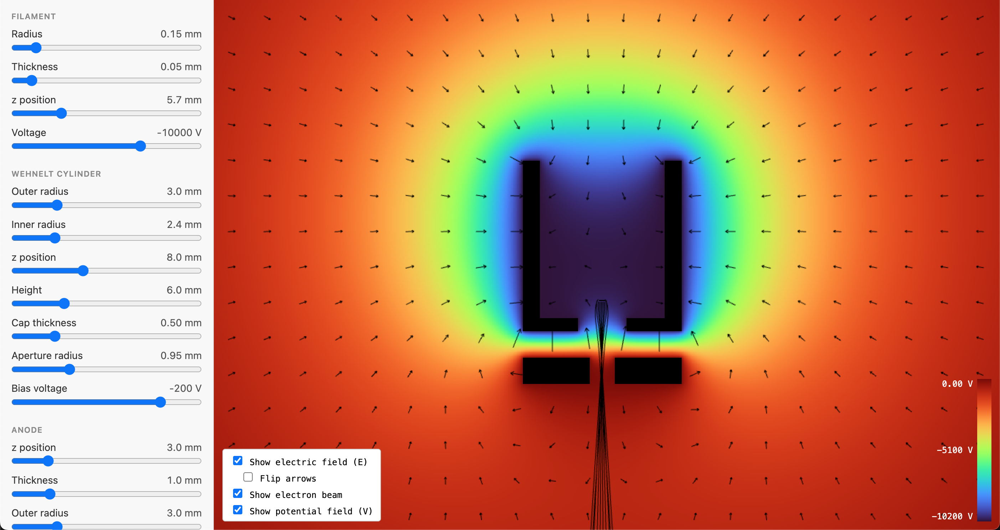

# Requirements

- [pnpm](https://pnpm.io/)
- [Rust](https://rust-lang.org/)
- [wasm-pack](https://wasm-bindgen.github.io/wasm-pack/)

# Running

1. Run

   ```console
   $ (cd crates/wasm-api && wasm-pack build -t web)
   $ cd web
   $ pnpm install
   $ pnpm dev
   ```

1. Open the URL printed in your terminal.
